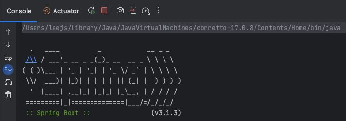
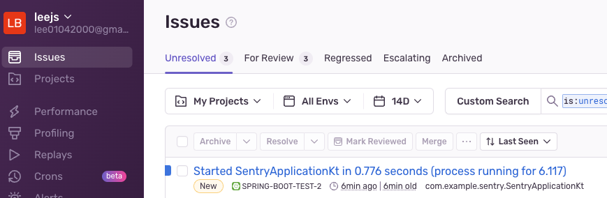

# Spring Sentry
- Spring에서 Sentry를 사용하는 방법에는 두 가지가 있다.
  - 플러그인 : 플러그인을 등록하면 스프링 버전에 따라 자동으로 종속성을 추가한다.
  - 종속성 : 스프링 버전에 따라 수동으로 종속성을 추가한다.
- 플러그인 또는 종속성이 추가된 경우
  - application.yaml 또는 application.properties 파일에서 설정을 자동으로 로드
  - BeforeSendCallback, BeforeBreadcrumbCallback, EventProcessor, Integration 빈을 등록한다.
```kotlin
plugins {
  id "io.sentry.jvm.gradle" version "3.12.0"
}
```
- 플러그인을 등록하면, 설정 정보를 추가한다.
```properties
# DSM(Data Source Number)는 어디에 이벤트 정보를 전달할지 정의한다.
# 만약 이 정보가 없다면 , SENTRY_DSN 환경 변수에서 값을 찾는다.
sentry.dsn=https://0c056d2f8c0...

# Set traces_sample_rate to 1.0 to capture 100%
# of transactions for performance monitoring.
# We recommend adjusting this value in production.
sentry.traces-sample-rate=1.0
# 기본적으로 핸들링되지 않은 예외들만 전달된다. 핸들링된 예외도 전달하기 위해선 sentry의 핸들링 우선순위를 최대로 만들어야 한다.
sentry.exception-resolver-order=-2147483647
```
- Sentry는 그냥 사용하기보다는 로깅 프레임워크와 함께 사용한다.
  - 스프링은 기본적으로 `Logback` 로깅 프레임워크를 지원한다.
  - 아래 종속성을 추가하면 로깅 프레임워크의 출력이 센트리를 향하는 기능을 추가할 수 있다.
```kotlin
dependencies{
  implementation("io.sentry:sentry-logback:6.28.0")
}
```
# Trouble Shooting!
- PKIX ERROR 에러가 발생한 경우
  - Sentry에 이벤트를 전송하는 과정에서 HTTPS 접속을 시도할 때 공인 인증된 인증서를 사용하지 않아 발생하는 이슈이다.
  - 이를 해결하기 위해선 두 가지 방법이 존재한다.
    - 사내 DNS에 `ingest.sentry.io` 도메인에 대한 인증서를 등록한다.
    - JRE에 인증서를 직접 등록한다.
      - [링크](https://colabear754.tistory.com/87)를 참고해 인증서를 다운로드하고 등록한다.
      -  JRE의 위치는 인텔리제이를 실행할 때 나오는 `java path`를 참고하도록 한다.

# Result
아래와 같이 새로운 이슈가 등록되면 성공이다.

# Reference
- https://docs.sentry.io/platforms/java/guides/spring-boot/
- https://docs.sentry.io/product/sentry-basics/dsn-explainer/